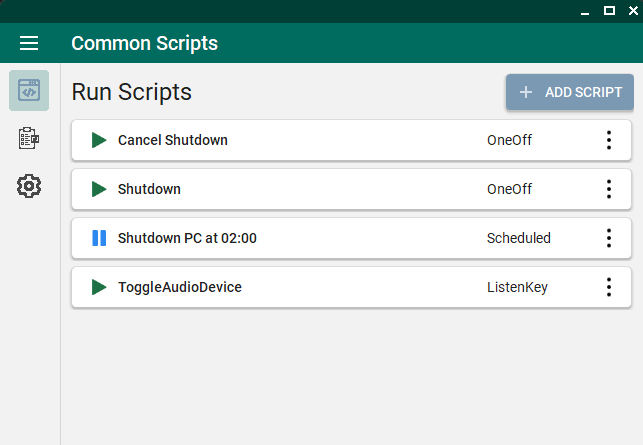
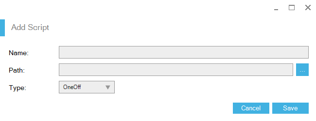

# Common Scripts Container
### Description
This is a container for scripts so you can schedule them, run once, or run based on a macro key.

### Third-party libraries
- [MetroSet-UI](https://github.com/N-a-r-w-i-n/MetroSet-UI) by [NARWIN](https://github.com/N-a-r-w-i-n/) as a skin for Winforms (sorry for using winforms 😞).
- [globalmousekeyhook](https://github.com/gmamaladze/globalmousekeyhook) by [George Mamaladze](https://github.com/gmamaladze) for the key listener.
- [Quartz.NET](https://github.com/quartznet/quartznet) to manage script execution.
- [Serilog](https://github.com/serilog/serilog) for the logging.
- [AudioDeviceCmdlets](https://github.com/frgnca/AudioDeviceCmdlets) by [frgnca](https://github.com/frgnca) for the Toggle Audio Device script.