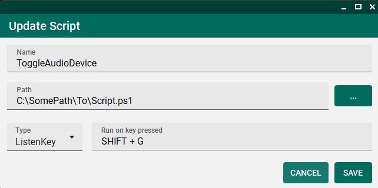

# Common Scripts Container

## Description

This is a container for scripts so you can schedule them, run once, or run based on a macro key.
It also have dark mode!

## How to use it

1. Download the [latest release](https://github.com/yeray697/CommonScriptsContainer/releases/latest) and extract it.
2. Place it in the desired installation path.
3. The first time you open it, a dialog will ask you for the installation path.
4. Start adding your first scripts!

## Third-party libraries

- [MaterialSkin 2](https://github.com/leocb/MaterialSkin) by [leocb](https://github.com/leocb/) as a skin for Winforms (sorry for using winforms 😞).
- [globalmousekeyhook](https://github.com/gmamaladze/globalmousekeyhook) by [George Mamaladze](https://github.com/gmamaladze) for the key listener.
- [Quartz.NET](https://github.com/quartznet/quartznet) to manage script execution.
- [Serilog](https://github.com/serilog/serilog) for the logging.
- [AudioDeviceCmdlets](https://github.com/frgnca/AudioDeviceCmdlets) by [frgnca](https://github.com/frgnca) for the Toggle Audio Device script.
- <s>[MetroSet-UI](https://github.com/N-a-r-w-i-n/MetroSet-UI) by [NARWIN](https://github.com/N-a-r-w-i-n/) as a skin for Winforms (sorry for using winforms 😞).</s> This library was used in 1.* versions